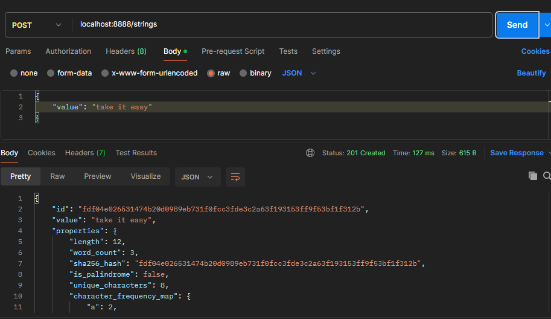
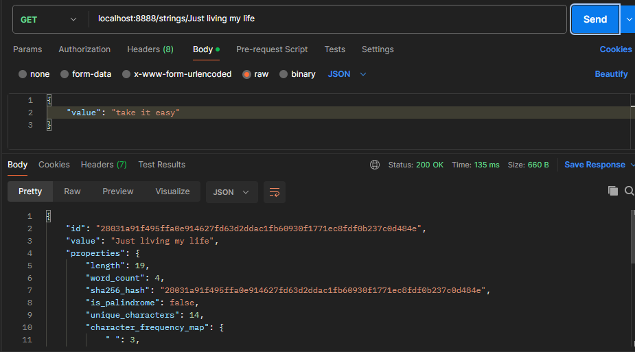
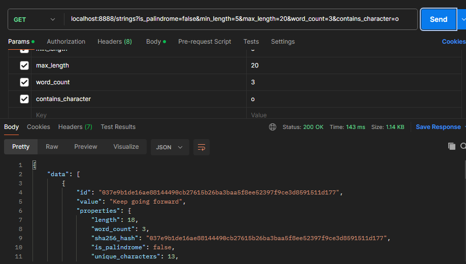
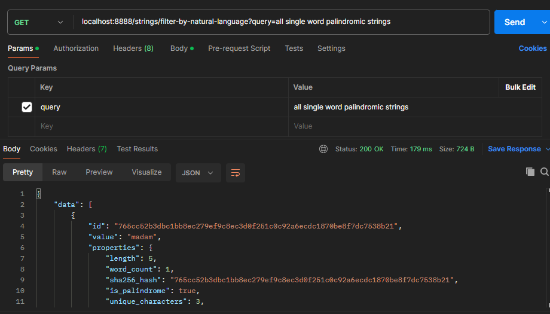

# Stage 1: String Analyzer Service

This is a RESTful API service that analyzes strings, computes their properties (length, palindrome status, unique characters, word count, SHA-256 hash, and character frequency), and stores them in a PostgreSQL database. The API supports creating, retrieving, filtering, and deleting strings, including natural language query filtering. The project is implemented using Node.js, Express, TypeScript, Sequelize ORM, and PostgreSQL.

# Features

- **Create/Analyze String:** POST endpoint to analyze and store a string with computed properties.

- **Get Specific String:** GET endpoint to retrieve a stored string by its value.

- **Filter Strings:** GET endpoint to filter strings by properties, such as palindrome and length.

- **Natural Language Filtering:** GET endpoint to filter strings using natural language queries.

- **Delete String:** DELETE endpoint to remove a stored string.

- **Database:** Uses PostgreSQL with Sequelize ORM, storing properties in a JSONB column for efficient querying.

- **Type Safety:** Written in TypeScript for strong type checking.

# Setup Instructions

1. Clone the repository
```bash
 git clone https://github.com/TemitopeAlawode/HNG-Stage-One-Task.git
```

2. Install dependencies
```bash
npm i express crypto pg pg-hstore dotenv nodemon sequelize sequelize-cli typescript @types/node @types/express @types/pg ts-node
```

3. Create a .env file in the project root and add the following environment variables
```bash
PORT=your-port-number
DB_HOST=your-db-variables
DB_PORT=your-db-variables
DB_NAME=your-db-variables
DB_USER=your-db-variables
DB_PASSWORD=your-db-variables
```

4. Set Up PostgreSQL and database connection

5. In package.json file, make some changes “scripts” and add
```bash
 "server": "nodemon --exec ts-node src/server.ts"
```

6. Start the server
```bash
npm run server
```

# Screenshots

1. Create/Analyze String [POST /strings]
- 

2. Get Specific String [GET /strings/{string_value}]
- 

3.  Get All Strings with Filtering
- 

4. Natural Language Filtering
- 
